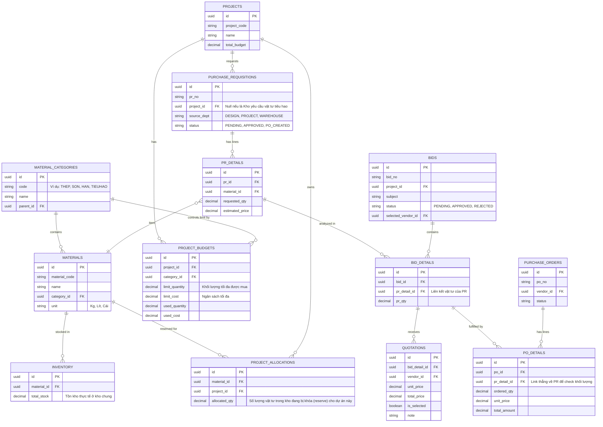

# Thiết kế Dữ liệu: Cốt lõi Kiểm soát Chi phí & Khối lượng (Phòng Thương Mại)

Từ định hướng "Kiểm soát Chi phí / Khối lượng / Chủng loại là yếu tố sống còn", kiến trúc Database được thiết kế theo mô hình **Project-Based Inventory Management** (Quản lý Tồn kho theo Dự án). Vật tư nhập về kho chung (`Central Warehouse`) nhưng phải được "gắn mác ảo" (Hard Allocation / Pegging) cho từng dự án để khóa luồng chi phí.

## 1. Cơ chế Hoạt động (Workflow)

1. **Ba nguồn PR (Phòng Thiết kế, Dự án, Kho)** sẽ tạo Request. Hệ thống tự map với `Project_ID` và `Category_ID`.
2. Trọng tâm kiểm soát: Trước khi tạo PO, hệ thống check **Ngân sách/Định mức khối lượng** của Dự án.
   - `Cost Check`: Tổng tiền PO có vượt Budget của hạng mục không?
   - `Volume Check`: Số lượng mua có vượt định mức Thiết kế/Dự án đã duyệt không?
3. **Nhập Kho (GRN):** Đẩy vào kho chung nhưng ghi log tài chính vào `Project Ledger`.

## 2. Sơ đồ Dữ liệu (ERD - Database Schema)

## 3. Điểm Chốt Cửa Phanh "Sống Còn" (Hard Controls)

1. **Gate 1 - Khi duyệt PR:** Trigger sẽ so sánh `PR_DETAILS.requested_qty` với `PROJECT_BUDGETS.limit_quantity - PROJECT_BUDGETS.used_quantity`. Tuýt còi ngay nếu vượt định mức.
2. **Gate 1.5 - Giải trình Mua sắm (Bid Analysis):** Trước khi tạo PO, hệ thống ánh xạ `PR_DETAILS` sang bảng `BIDS` để ghi nhận báo giá từ nhiều nhà cung cấp nhỏ (`QUOTATIONS`). Phải chọn Vendor chiến thắng.
3. **Gate 2 - Khi làm PO:** Buộc phải Map `PO_DETAILS` với `BID_DETAILS` hoặc `PR_DETAILS`. Giá PO nếu đội lên quá X% so với `estimated_price` thì phải luân chuyển qua Ma trận duyệt của Ban Giám Đốc.
4. **Gate 3 - Kho Chung nhưng Cost Riêng:** Khi kho nhập vật tư vào hệ thống (`INVENTORY`), số lượng này đồng thời cộng vào `PROJECT_ALLOCATIONS` dựa trên PR gốc. Vật tư này về lý thuyết nằm ở kho chung, nhưng đội sản xuất của Dự Án Khác tuyệt đối KHÔNG thể xuất kho dùng lố phần của dự án chủ sở hữu được.
