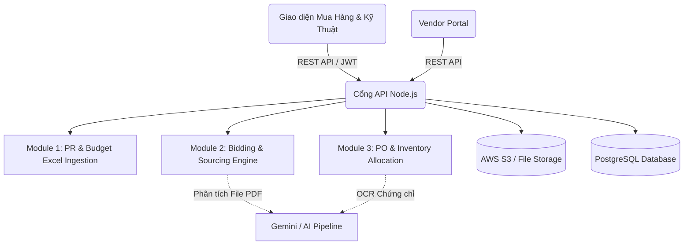
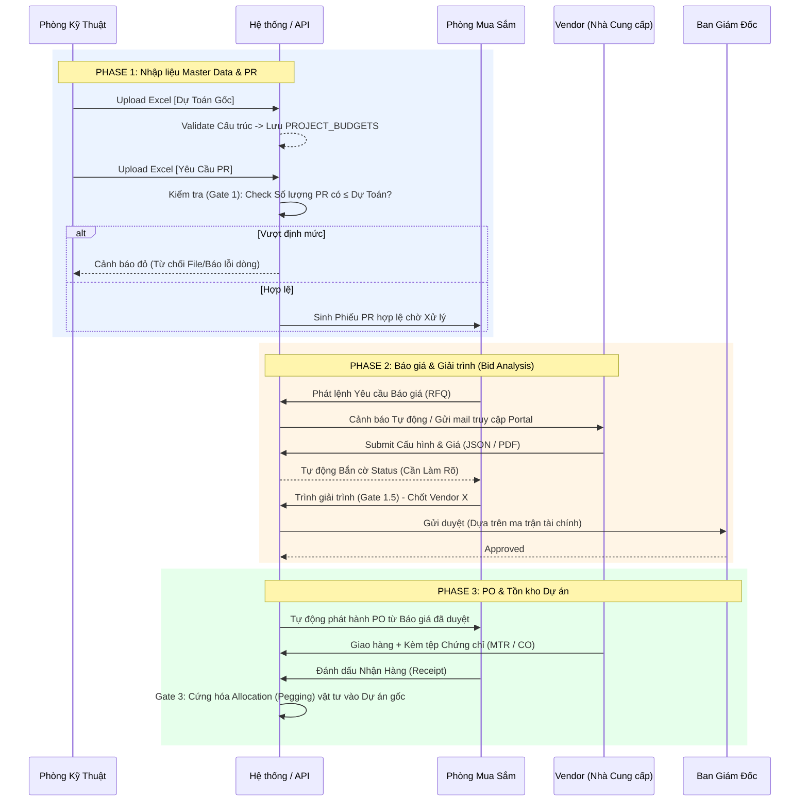
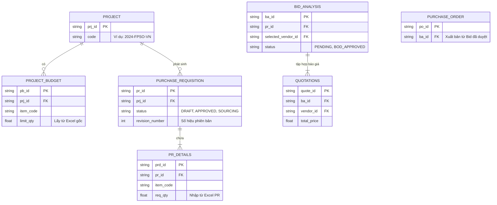

# TỔNG QUAN KIẾN TRÚC KỸ THUẬT & NGHIỆP VỤ (VẬT TƯ E-PROCUREMENT)

Tài liệu này xác định ranh giới hệ thống, luồng dữ liệu, cấu trúc luân chuyển và các cổng API Map chuẩn bị cho việc lập trình. Tất cả nghiệp vụ đều bám sát đặc thù đóng tàu/gia công (ETO) với đầu vào từ Excel.

---

## 1. KIẾN TRÚC TỔNG THỂ (SYSTEM ARCHITECTURE)

**Stack Công nghệ Khuyến nghị:**
- **Frontend / Client:** Next.js (React) kết hợp Tailwind CSS. Xây dựng Dashboard Quản trị + Vendor Portal (Nơi Cung cấp báo giá).
- **Backend / API:** Node.js (Express hoặc NestJS) - Cực kỳ phù hợp để xử lý luồng dữ liệu I/O từ Excel và JSON phức tạp của báo giá.
- **Database:** PostgreSQL. Dùng chuẩn Relational cho Transaction tài chính (ACID) và dùng type `JSONB` cho các thông số kỹ thuật (Specs) không cố định.
- **File Storage:** AWS S3 / MinIO (lưu file PR Excel, Báo giá PDF, Chứng chỉ CO/CQ/MTR).
- **AI Intelligence:** Gemini Vision AI Agent 
  - Nhiệm vụ phân tích Báo giá PDF từ Vendor không chuẩn hóa để map vào database.
  - OCR đọc bảng thành phần hoá học (Impact / CE) trong chứng chỉ MTR ở Phase 4.

**Sơ đồ Kiến trúc Cấu kiện:**

---

## 2. LUỒNG NGHIỆP VỤ CỐT LÕI (SWIMLANE WORKFLOW)

Sơ đồ giới hạn người dùng và rẽ nhánh của dòng chảy mua sắm.

---

## 3. LƯỢC ĐỒ QUAN HỆ DỮ LIỆU CỐT LÕI (LOGIC DATA ERD)

---

## 4. BẢNG MAPPING CỔNG GIAO TIẾP (API MAP)

| Phase | METHOD | Endpoints Kỹ Thuật (RESTful) | Ý nghĩa Logic & Input/Output |
| :--- | :---: | :--- | :--- |
| **P1** | `POST` | `/api/v1/projects/{id}/budgets/import` | (Upload Excel) - Trả về `200` mảng lỗi nếu sai UOM, sai cấu trúc cột. Ghi `PROJECT_BUDGETS`. |
| **P1** | `POST` | `/api/v1/prs/import` | (Upload Excel) - Trigger GATE 1. Quét PR items vs Budget. Trả về Validation Array (Đỏ/Xanh). |
| **P1** | `GET` | `/api/v1/prs/{id}` | Lấy chi tiết PR và các cờ trạng thái (vd: Cần Làm Rõ) trên dòng. |
| **P2** | `POST` | `/api/v1/rfq/generate` | Xả từ `PR_DETAILS` thành thư mời thầu. |
| **P2** | `POST` | `/api/v1/vendors/quotes/submit` | Vendor submit giá. Lọc dữ liệu thô (JSONB Specs). |
| **P2** | `GET` | `/api/v1/bids/{pr_id}/analysis-matrix` | Đổ dữ liệu tổng hợp ma trận so sánh 3-5 báo giá (Gate 1.5). |
| **P2** | `POST` | `/api/v1/bids/approve` | Cấp BOD submit quyết định phê duyệt Vendor X. |
| **P3** | `POST` | `/api/v1/pos/generate-from-bid` | Hệ thống tự xả PO dựa trên `quote_id` đã duyệt. |
| **P3** | `PUT` | `/api/v1/pos/{id}/receive` | Kho thực hiện Receipt. Kích hoạt Gate 3 (Allocation). |
| **P4** | `POST` | `/api/v1/inventory/upload-cert` | Upload file MTR/CO. Push sang API Gemini OCR check valid mác thép/Nhiệt độ. |
